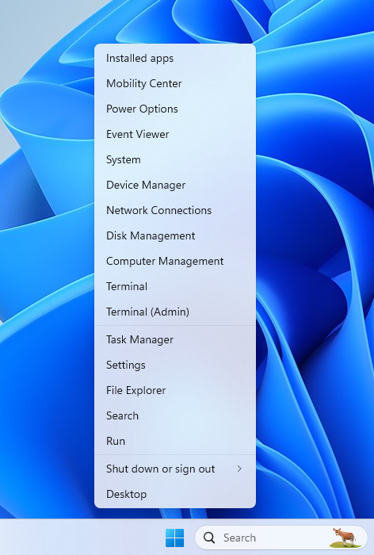
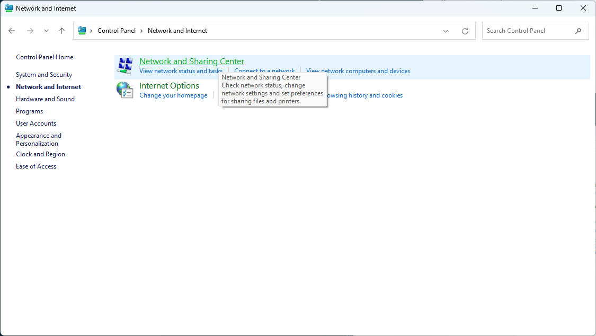
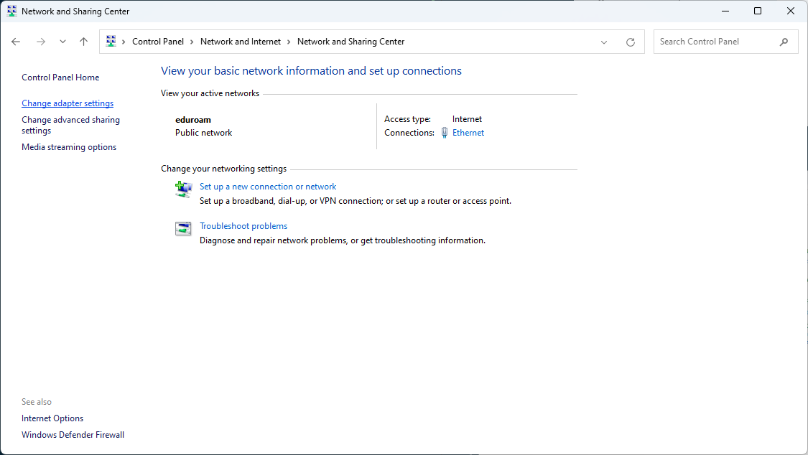
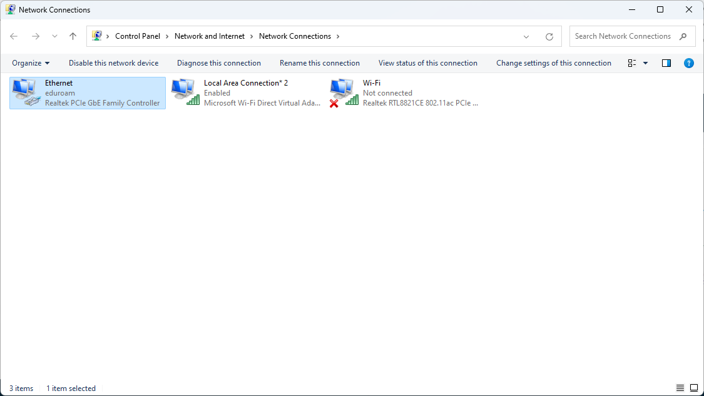
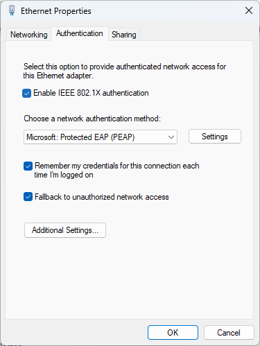

# NNCT Networking Setting

## Windows

## 1. 流れ

1\. Wired AutoConfigをONにする

2\. 802.1x認証設定を行う

3\. ログインフォームに自分のIDとパスワードを入力

## 2. 具体的な方法

### 1. Wired AutoConfigを起動する

まず、**タスクマネージャー**を起動する

Windowsボタンを右クリックしタスクマネージャーをクリック

Serviceを選択し、Wired AutoConfigを右クリックし起動をクリック

### 2. 802.1x認証設定

まず、コントロールパネルを起動する

Win keyを押して`control panel`と入力

`ネットワークとインターネット`を選択

`インターネットと共有センター`を選択

`アダプターの詳細設定`を選択

`Ethernet`を右クリックしてプロパティをクリック

まず、IEEE802.1X認証にチェックを入れます

次にその下にある設定をクリックします

***一番上のチェックを外してください***

※これを外さないと寮ネットに接続できなくなります

次に下のほうにある認証方法を`EAP-MSCHAPv2`にします

`OK`をクリックします

次に`追加設定`をクリックします

認証モードを`ユーザー認証`にしてください

そしてその右にあるボタンをクリックしてIDと
パスワードを設定します

## 3.IDとパスワードの入力

ここに**演習室で使用するMicrosoftのIDとパスワード**を入力してください

※パスワードは初期に使ったパスワードです

最後にOKをすべてクリックして、接続できたか確認してください

## 終わりに

ここまでお疲れ様です。良いインターネットライフを。