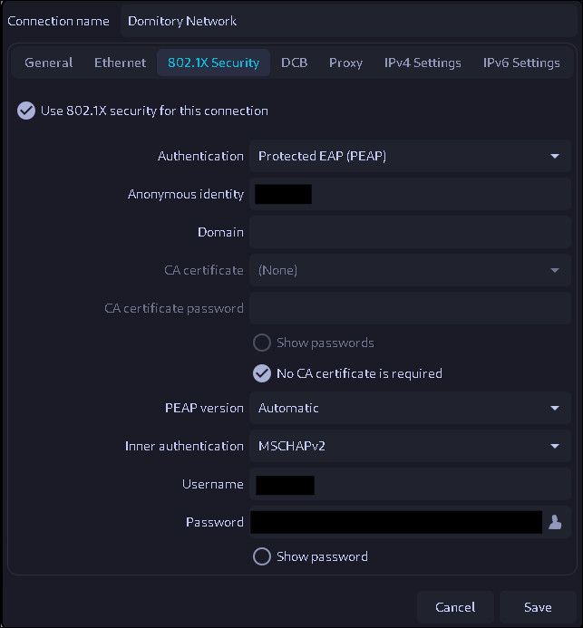

# Contents

### 1. [Install NetworkManger](#1-install-networkmanger)

### 2. [Lauch NetworkManger](#2-lauch-networkmanger)

### 3. [802.1x authentication settings](#3-8021x-authentication-settings)

### 4. [Connection Confirmation](#4-connection-confirmation)

# Network setting

## Install NetworkManager

```bash
sudo apt install networkmanager
```

## Lauch NetworkManager

```bash
sudo systemctl start NetworkManager
```

When NetworkManager starts at the same time the OS starts

```bash
sudo systemctl enable NetworkManager
```

## 802.1x authentication settings

Please configure as follows

| Setting items | |
| ---- | ---- |
| Authentication | Protected EAP (PEAP) |
| Anonymous Identity | Student ID |
| No CA | check☑ |
| Inner Atuthentication | MSCHAPv2 |
| Username | Student ID |
| Password | Microsoft Initial password |



## Connection Confirmation

```bash
ping -c8 google.com
```