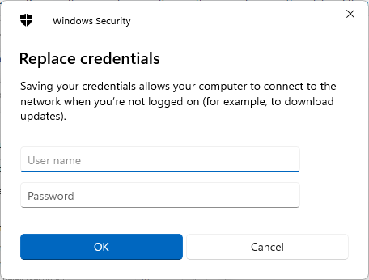
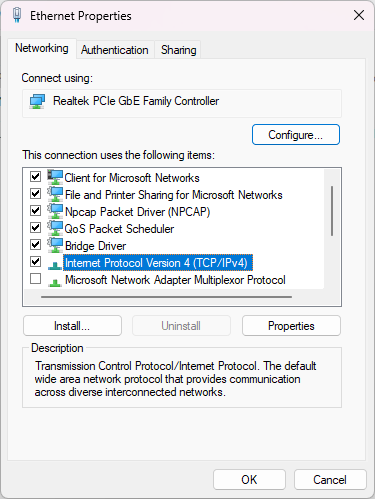

## Contents

1. [Internet Connection Procedures](#internet-connection-procedures)

    1. [Running for Wired AutoConfig](#1-activate-wired-autoconfig)

    2. [Configure 802.1x authentication settings](#2-configure-8021x-authentication-settings)

    3. [Enter your ID and Password in the form](#3enter-your-id-and-password)

2. [Troubleshoot](#troubleshoot)

## Internet Connection Procedures

### 1. Activate Wired AutoConfig

First, launch **Task Manager**

Right click windows button and then click Task Manager

Click `Service` and right click Wired AutoConfig and then click `Active`

### 2. Configure 802.1x authentication settings

First, launch **Control Panel**

Press Windows key or windows button and then type `control panel`

Click `Network and Internet`

Click `Internet and Sharing Center`

Click `Change Adapter Settings`

Right click `Eternet` and then click `Property`

Click check box of `IEEE802.1X authentication`

Then click on `Settings` below it

***Uncheck the box at the top***

※You can't connect dormitory network if you uncheck it 

Then, set the authentication method to `EAP-MSCHAPv2` at the bottom

Click `OK`

Next, click on `Additional Settings`

Please set the authentication mode to `user authentication`

Then click the button to the right of it to set up your ID and set your ID and password

## 3.Enter your ID and Password

Enter here your **Microsoft ID and password** for the exercise room

※Password is the password you used initially.

Finally, click OK all the way and confirm that you have made the connection

# Troubleshoot

- I can't connect to the Internet even though I've set up everything so far.

    It may not be automatically configured with IPv4 settings

    First, launch the control panel

    Instructions on how to launch it can be found [here](#2-configure-8021x-authentication-settings)

    And when you get here, open the Ethernet Properties.

    

    Then select IPv4 and open the properties

    

    If both settings are set to manual, set them to automatic as shown in the image below

    

    Once you have set the settings to automatic, press OK to confirm the connection

## Finally

Thanks for your hard work so far. Have a good internet life.