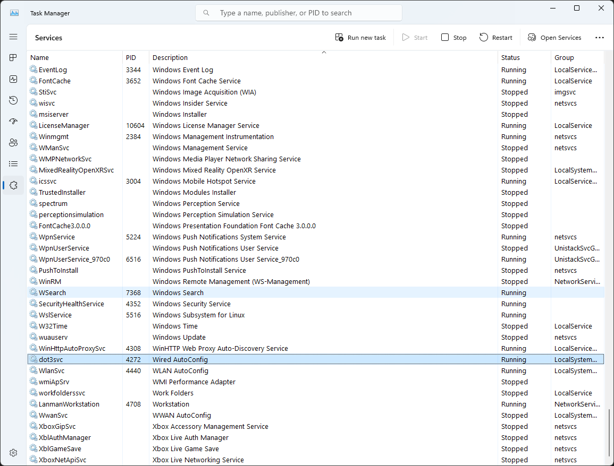
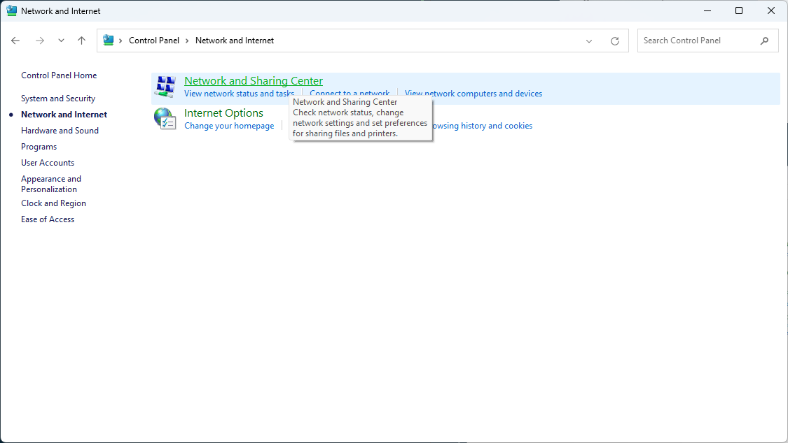
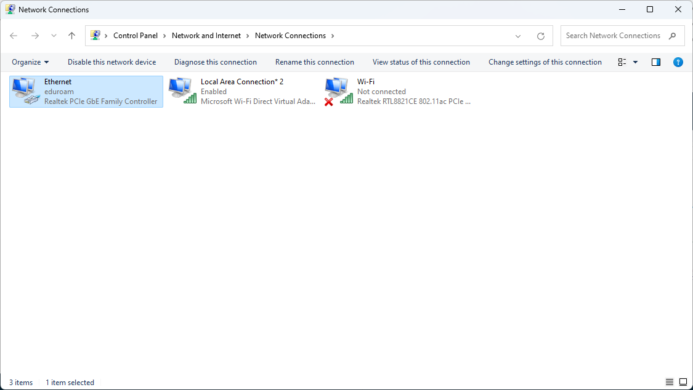
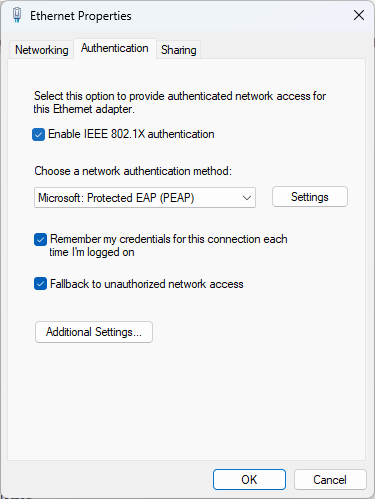
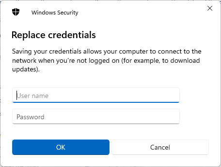
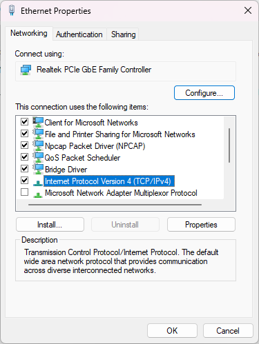
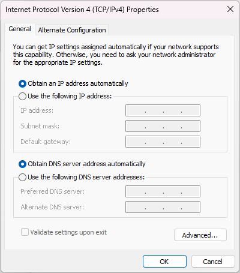

## 目次

1. [インターネット接続の手順](#接続の手順)

    1. [Wired AutoConfigをONにする](#1-wired-autoconfigを起動する)

    2. [802.1x認証設定を行う](#2-8021x認証設定)

    3. [ログインフォームに自分のIDとパスワードを入力](#3idとパスワードの入力)

2. [トラブルシュート](#トラブルシュート)

## 接続の手順

### 1. Wired AutoConfigを起動する

まず、**タスクマネージャー**を起動する

Windowsボタンを右クリックしタスクマネージャーをクリック

Serviceを選択し、Wired AutoConfigを右クリックし起動をクリック

### 2. 802.1x認証設定

まず、コントロールパネルを起動する

Win keyを押して`control panel`と入力

`ネットワークとインターネット`を選択

`インターネットと共有センター`を選択

`アダプターの詳細設定`を選択

`Ethernet`を右クリックしてプロパティをクリック

まず、IEEE802.1X認証にチェックを入れます

次にその下にある設定をクリックします

***一番上のチェックを外してください***

※これを外さないと寮ネットに接続できなくなります

次に下のほうにある認証方法を`EAP-MSCHAPv2`にします

`OK`をクリックします

次に`追加設定`をクリックします

認証モードを`ユーザー認証`にしてください

そしてその右にあるボタンをクリックしてIDと
パスワードを設定します

## 3.IDとパスワードの入力

ここに**演習室で使用するMicrosoftのIDとパスワード**を入力してください

※パスワードは初期に使ったパスワードです

最後にOKをすべてクリックして、接続できたか確認してください

# トラブルシュート

- ここまで設定できたのにインターネットにつながりません

    IPv4の設定で自動設定になっていないかもしれません

    まず、コントロールパネルを立ち上げましょう。

    立ち上げる方法は[ここ](#2-8021x認証設定)に記載してあります

    そしてここまで来たらEthernetのプロパティを開いてください。

    

    つぎにIPv4を選択してプロパティを開いてください

    

    もし、ここで両方とも手動設定になっていたら下の画像のように自動設定にしてください

    

    自動設定にしたら、OKをすべて押して接続を確認してください

## 終わりに

ここまでお疲れ様です。良いインターネットライフを。